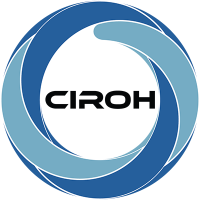

# NextGen Research Datastream (NRDS) Visualizer

| | |
| --- | --- |
|  | Funding for this project was provided by the National Oceanic & Atmospheric Administration (NOAA), awarded to the Cooperative Institute for Research to Operations in Hydrology (CIROH) through the NOAA Cooperative Agreement with The University of Alabama (NA22NWS4320003). |

This app uses a build-less vanilla JavaScript frontend (native ES modules, no bundler) with Tethys as the backend.


The visualizer shows NextGen hydrofabric catchments, flowpaths, and CONUS gauges on an interactive map. Click any catchment to open its time series chart right on the feature. One control menu lets you pick a model run, toggle map layers, and switch between light and dark themes. Your theme choice is remembered across visits.


Built on the Tethys Platform [(Swain et al., 2015)](https://doi.org/10.1016/j.envsoft.2015.01.014), it enables web based exploration of model outputs [(CIROH, 2025)](https://github.com/CIROH-UA/ngiab-client).

## Usage Guide

### Assited using `launchApp` Script

One of the advantages of the `launchApp.sh` script is that it allows the user to run the application inside a container, so no need to install extra python dependencies or npm packages


You should be able to see multiple outputs through the UI:


### Unassisted Usage


Define the env variables and running the container

```bash
# Set environment variables
export TETHYS_CONTAINER_NAME="tethys-nrds"               \
       TETHYS_REPO="awiciroh/tethys-nrds"                \
       TETHYS_TAG="latest"                               \
       NGINX_PORT=80                                     \
       SKIP_DB_SETUP=false                               \
       CSRF_TRUSTED_ORIGINS="[\"http://localhost:${NGINX_PORT}\",\"http://127.0.0.1:${NGINX_PORT}\"]"
```
# Run container

```bash
docker run --rm -d \
  -p "$NGINX_PORT:8080" \
  --name "$TETHYS_CONTAINER_NAME" \
  -e SKIP_DB_SETUP="$SKIP_DB_SETUP" \
  -e CSRF_TRUSTED_ORIGINS="$CSRF_TRUSTED_ORIGINS" \
  "${TETHYS_REPO}:${TETHYS_TAG}"
```
Verify deployment:

```bash
docker ps
# CONTAINER ID   IMAGE                          PORTS                 NAMES
# b1818a03de9b   awiciroh/tethys-nrds:latest   0.0.0.0:80->80/tcp    tethys-nrds
```

Access at: http://localhost:80


### Visualization Features

Click any catchment polygon to open its time series chart in a popup anchored on the feature, with a short header of the catchment attributes. Clicking a catchment also highlights the reach that runs through it. On a phone the chart opens in the bottom sheet instead.


One control menu holds what you need to drive the map. Choose the model run, cycle, and output file through the run selector, toggle the map layers, and switch the light or dark theme, all from the same place.


Data from CFE_NOM and LSTM can be retrieved for the available forecasts. This lets you quickly search the data you want from the [S3 bucket](https://datastream.ciroh.org/index.html) containing the output of the [NextGen DataStream](https://github.com/CIROH-UA/ngen-datastream), and explore or download as needed.


## Development Installation

Install the Tethys dependencies and run the Tethys development server. The frontend is served as static ES modules, so there is no separate node build or dev server to run.

### The search index

The search box reads a slim hydrofabric index that the Docker build generates. A dev server has no image build, so build it once by hand:

```bash
python3 scripts/build_slim_index.py       # see --help for options and a local-copy shortcut
```

Without it the app falls back to the full 103 MB upstream index, so search still works but is slower to become available.


0. First create a Virtual Environment with the tool of your choice and then run the following commands

1. Install libmamba and make it your default solver (see: A Faster Solver for Conda: Libmamba):

    ```bash
    conda update -n base conda
    conda install -n base conda-libmamba-solver
    conda config --set solver libmamba

    ```
2. Install the Tethys Platform

    Using `conda`

    ```bash
    conda install -c conda-forge tethys-platform django=<DJANGO_VESION>

    ```
    or using `pip`

    ```
    pip install tethys-platform django=<DJANGO_VERSION>

    ```

3. Create a `portal_config.yml` file :

    To add custom configurations such as the database and other local settings you will need to generate a portal_config.yml file. To generate a new template portal_config.yml run:

    ```bash
    tethys gen portal_config
    ```

    You can customize your settings in the portal_config.yml file after you generate it by manually editing the file or by using the settings command command. Refer to the Tethys Portal Configuration documentation for more information.


4. Configure the Tethys Database

    There are several options for setting up a DB server: local, docker, or remote. Tethys Platform uses a local SQLite database by default. For development environments you can use Tethys to create a local server:

    ```bash
    tethys db configure
    ```

5. Install Node Version Manager and Node.js:

    5.1 Install Node Version Manager (nvm): https://github.com/nvm-sh/nvm?tab=readme-ov-file#install--update-script

    5.2 CLOSE ALL OF YOUR TERMINALS AND OPEN NEW ONES

    5.3 Use NVM to install Node.js 20:

    ```bash
    nvm install 20
    nvm use 20
    ```

6. Install the PDM dependency manager:
    ```bash
    pip install --user pdm
    ```

    > **_NOTE:_** if you have previously installed pdm in another environment, uninstall pdm first (`pip uninstall pdm`), and then reinstall as shown above with the new environment active.


7. Clone the app and install into the Tethys environment in development mode:

    ```bash
    git clone https://github.com/CIROH-UA/ngiab-client.git
    cd ngiab-client
    pdm install
    npm install --include=dev
    cd ../
    ```

## PDM Tips

See below for more PDM tips like how to manage dependencies, install dependencies, and run scripts.

### Install only dev dependencies

* Install all dev dependencies (test & lint)

    ```bash
    pdm install -G:all
    ```

* Install only test dependencies

    ```bash
    pdm install -G test
    ```

* Install only lint and formatter dependencies

    ```bash
    pdm install -G lint
    ```

### Managing dependencies

* Add a new dependency:

1. Add the package using `pdm`:

    ```bash
    pdm add <package-name>
    ```

2. Manually add the dependency to the `install.yml`.

    > **_IMPORTANT:_** Dependencies are not automatically added to the `install.yml` yet!

* Add a new dev dependency:

    ```bash
    pdm add -dG test <package-name>
    pdm add -dG lint <package-name>
    ```

    > **_NOTE:_** Just use `pdm` to install and manage dev dependencies. The `install.yml` does not support dev dependencies, but they shouldn't be needed in it anyway, right?

* Add a new optional dependeny:

    ```bash
    pdm add -G <group-name> <package-name>
    ```

    > **_NOTE:_** You'll need to decide whether or not to add the optional dependencies to the `install.yml` b/c it does not support optional dependencies. You may consider using `pdm` to manage the optional dependencies.

* Remove a dependency:

1. Remove it from the `pyproject.yaml` and lock file:

    ```bash
    pdm remove --no-sync <package-name>
    ```

2. Manually remove it from the `install.yml`

3. If you want to remove it from the environment, use `pip` or `conda` to remove the package.

    > **_IMPORTANT:_** TL;DR: Running `pdm remove` without the `--no-sync` will remove nearly all of the dependencies in your environment. While `pdm remove` is capable of removing the package from the environment, running `pdm remove` without the `--no-sync` option can break your Tethys environment. This is because `pdm` will attempt to get the environment to match the dependencies listed in your `pyproject.toml`, which usually does not include all of the dependencies of Tethys.

### PDM Scripts

The project is configured with several PDM convenience scripts:

```bash
# Run linter
pdm run lint

# Run formatter
pdm run format

# Run tests
pdm run test

# Run all checks
pdm run all
```

## Formatting and Linting Manually

This package is configured to use yapf code formatting

1. Install lint dependencies:

    ```bash
    pdm install -G lint
    ```

2. Run code formatting from the project directory:

    ```bash
    yapf --in-place --recursive --verbose .

    # Short version
    yapf -ir -vv .
    ```

3. Run linter from the project directory:

    ```bash
    flake8 .
    ```

    > **_NOTE:_** The configuration for yapf and flake8 is in the `pyproject.toml`.

## Testing Manually

This package is configured to use pytest for testing

1. Install test dependencies:

    ```bash
    pdm install -G test
    ```

2. Run tests from the project directory:

    ```bash
    pytest
    ```

    > **_NOTE:_** The configuration for pytest and coverage is in the `pyproject.toml`.


## Frontend

The frontend is build-less. The source under `tethysapp/nrds/public/frontend` is shipped as written and loaded as native ES modules, with dependencies resolved from a CDN import map. There is no bundler and no build step.

## Test the Frontend

Run the frontend unit tests with the built-in Node test runner:

```
npm run test:vanilla
```

## Acknowledgements

The original Tethys app scaffold this project grew from is based on the excellent work done by @Jitensid that can be found on GitHub here: [Jitensid/django-webpack-dev-server](https://github.com/Jitensid/django-webpack-dev-server).

## Contribute
Please feel free to contribute!